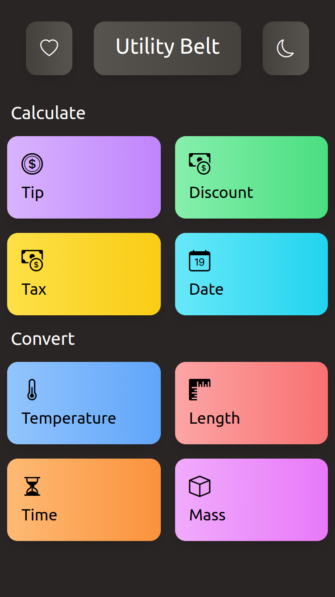

# Utility Belt

A collection of utilities that people often need

### Features

- Light and dark theme support
- Automatic dark theme based on device settings
- PWA for instant cache installation and offline usage
- Tailwind themed user interface

### Utilities

- Calculators

  - Tip Calculator
  - Tax Calculator
  - Discount Calculator
  - Date Difference Calculator

- Converters

  - Temperature Converter
    - Celsius, Fahrenheit, Kelvin
  - Length Converter
    - Kilometer, Meter, Centimeter, Mile, Yard, Foot, Inch
  - Time Converter
    - Seconds, Minutes, Hours, Days, Weeks, Months, Years, Decades, Centuries
  - Mass Converter
    - Tonne, Kilogram, Gram, Milligram, Imperial Ton, US Ton, Pound, Ounce

Use it now at https://utility-belt.netlify.app/

 
